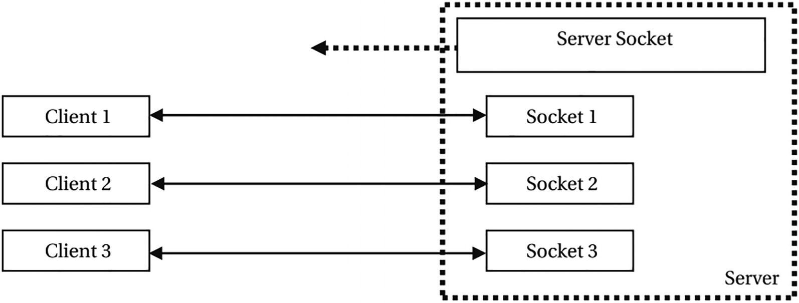
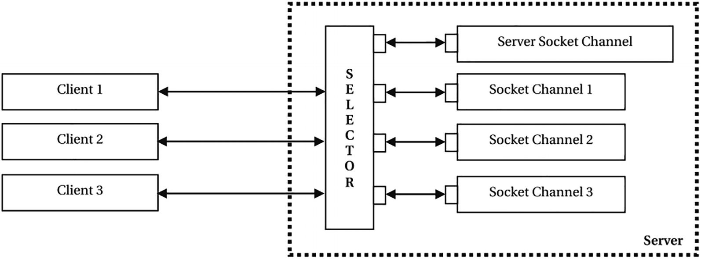

= Network

== TCP Server and Clients Together

Two Socket objects, one at each end, represent a connection. The ServerSocket object in the server keeps waiting for incoming connection requests from a client.

== Non-blocking Socket Programming

Let’s first discuss the situation on the server side. The server side is your restaurant. The person at the counter, who interfaces with all customers, is called a selector. A selector is an object of the Selector class. Its sole job is to interact with the outside world. It sits between remote clients interacting with the server and the things inside the server. A remote client never interacts with objects working inside the server, as a customer in the restaurant never interacts directly with servers in the kitchen.

