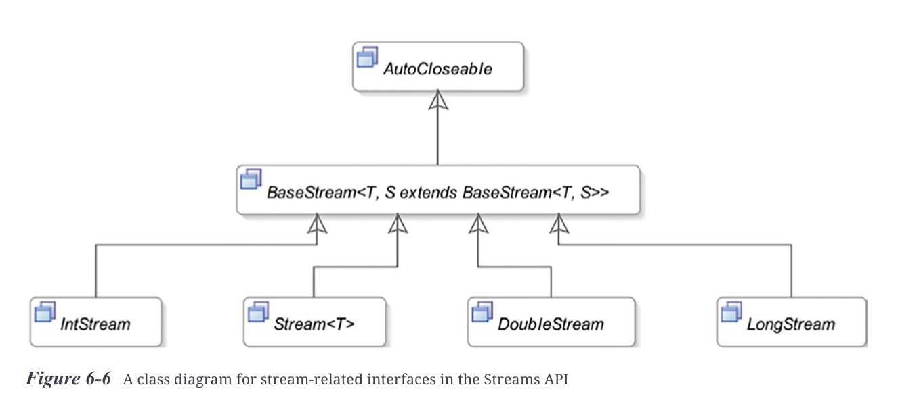
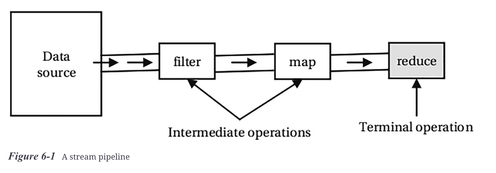
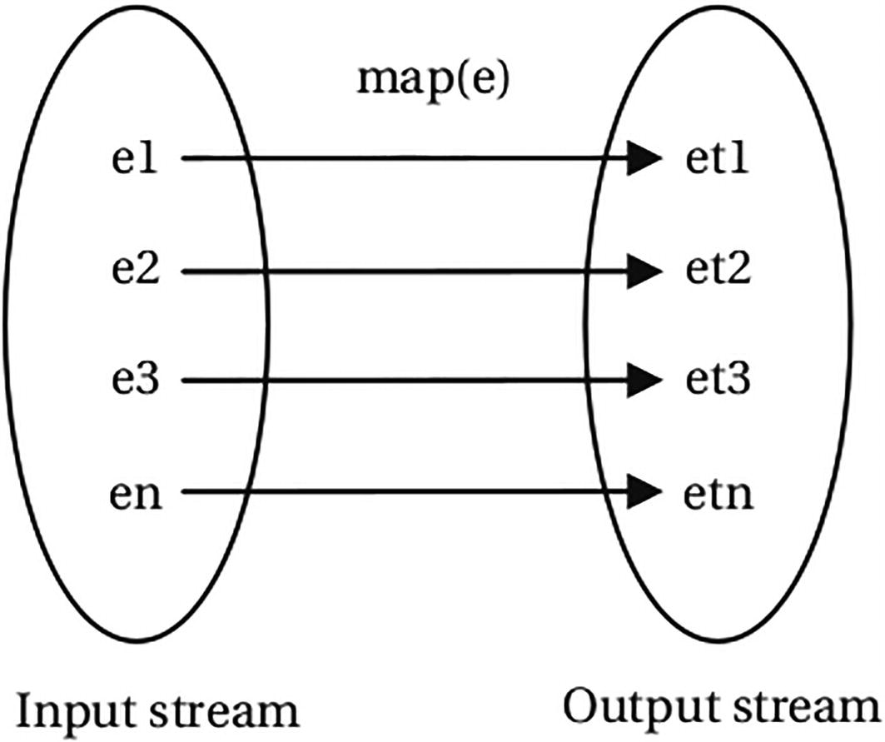
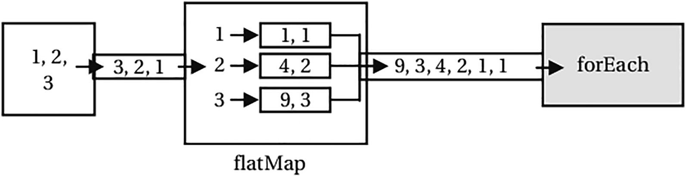
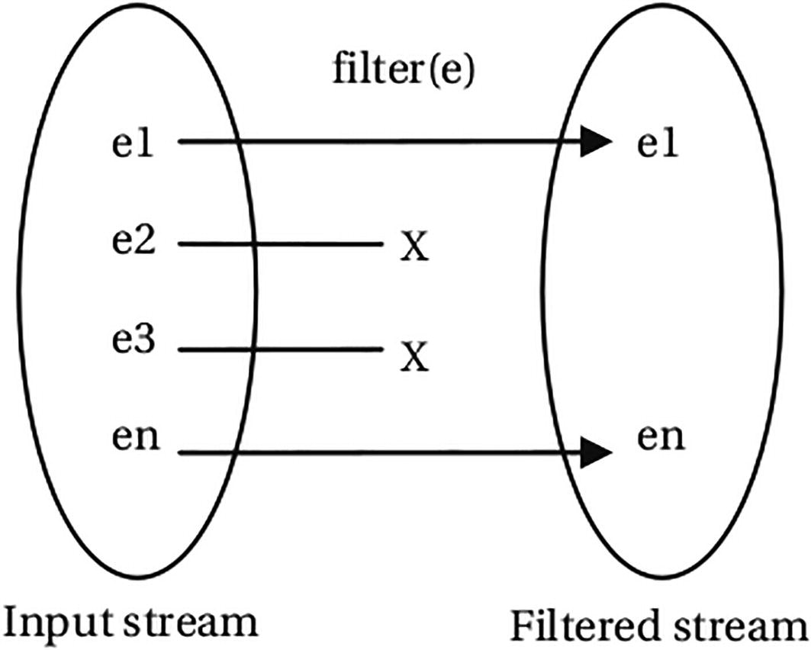
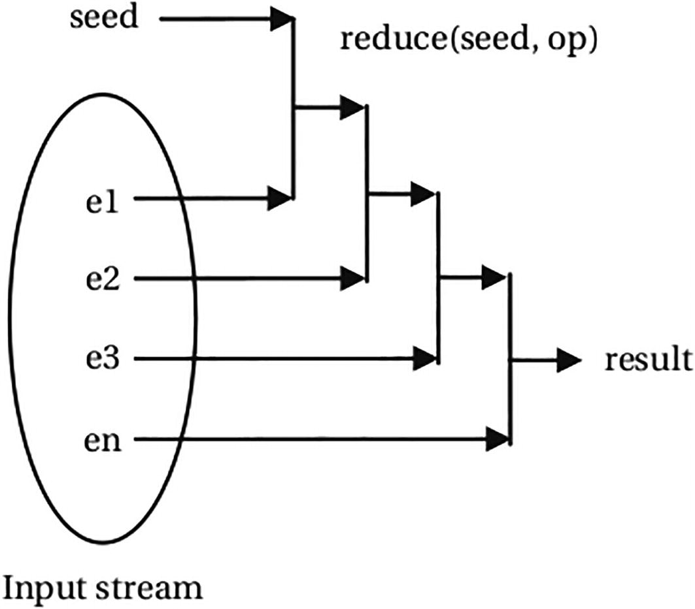

= Stream

== Stream pipeline

== Applying Operations to Streams

The Stream interface contains a method with the same name as the name of the operation in the table. You have seen some of these operations in previous sections. Subsequent sections cover them in detail.

List of Commonly Used Stream Operations Supported by the Streams API
|===
|Operation |Type |Description

|Distinct
|Intermediate
|Returns a stream consisting of the distinct elements of this stream. Elements e1 and e2 are considered equal if e1.equals(e2) returns true.

|Filter
|Intermediate
|Returns a stream consisting of the elements of this stream that match the specified predicate.

|flatMap
|Intermediate
|Returns a stream consisting of the results of applying the specified function to the elements in this stream. The function produces a stream for each input element, and the output streams are flattened. Performs one-to-many mapping.

|Limit
|Intermediate
|Returns a stream consisting of the elements in this stream, truncated to be no longer than the specified size.

|Map
|Intermediate
|Returns a stream consisting of the results of applying the specified function to the elements in this stream. Performs one-to-one mapping.

|peek
|Intermediate
|Returns a stream whose elements consist of this stream. It applies the specified action as it consumes elements of this stream. It is mainly used for debugging purposes.

|Skip
|Intermediate
|Discards the first N elements in the stream and returns the remaining stream. If this stream contains fewer than N elements, an empty stream is returned.

|dropWhile
|Intermediate
|Returns the elements of the stream, discarding the elements from the beginning for which a predicate is true. This operation was added to the Streams API in Java 9.

|takeWhile
|Intermediate
|Returns elements from the beginning of the stream, which match a predicate, discarding the rest of the elements. This operation was added to the Streams API in Java 9.

|sorted
|Intermediate
|Returns a stream consisting of the elements in this stream, sorted according to natural order or the specified Comparator. For an ordered stream, the sort is stable.

|allMatch
|Terminal
|Returns true if all elements in the stream match the specified predicate, false otherwise. Returns true if the stream is empty.

|anyMatch
|Terminal
|Returns true if any element in the stream matches the specified predicate, false otherwise. Returns false if the stream is empty.

|findAny
|Terminal
|Returns any element from the stream. An empty Optional is returned for an empty stream.

|findFirst
|Terminal
|Returns the first element of the stream. For an ordered stream, it returns the first element in the encounter order; for an unordered stream, it returns any element.

|noneMatch
|Terminal
|Returns true if no elements in the stream match the specified predicate, false otherwise. Returns true if the stream is empty.

|forEach
|Terminal
|Applies an action for each element in the stream.

|Reduce
|Terminal
|Applies a reduction operation to compute a single value from the stream.

|===

== Map

A map operation (also known as mapping) applies a function to each element of the input stream to produce another stream (also called an output stream or a mapped stream). The number of elements in the input and output streams is the same. The operation does not modify the elements of the input stream—at least it is not supposed to.

== FlatMap

The Streams API also supports one-to-many mapping through the flatMap operation.

It works as follows:

1. It takes an input stream and produces an output stream using a mapping function.
2. The mapping function takes an element from the input stream and maps the element to a stream. The type of input element and the elements in the mapped stream may be different. This step produces a stream of streams. Suppose the input stream is a Stream<T> and the mapped stream is Stream<Stream<R» where T and R may be the same or different.
3. Finally, it flattens the output stream (i.e., a stream of streams) to produce a stream. That is, the Stream<Stream<R» is flattened to Stream<R>.

Flattening a stream using the flatMap method

== Filter

The filter operation is applied on an input stream to produce another stream, which is known as the filtered stream. The filtered stream contains all elements of the input stream for which a predicate evaluates to true. A predicate is a function that accepts an element of the stream and returns a boolean value. Unlike a mapped stream, the filtered stream is of the same type as the input stream.

== Reduce

The reduce operation combines all elements of a stream to produce a single value by applying a combining function repeatedly. It is also called a reduction operation or a fold. Computing the sum, maximum, average, count, etc. of elements of a stream of integers are examples of reduce operation. Collecting elements of a stream in a List, Set, or Map is also an example of the reduce operation.

