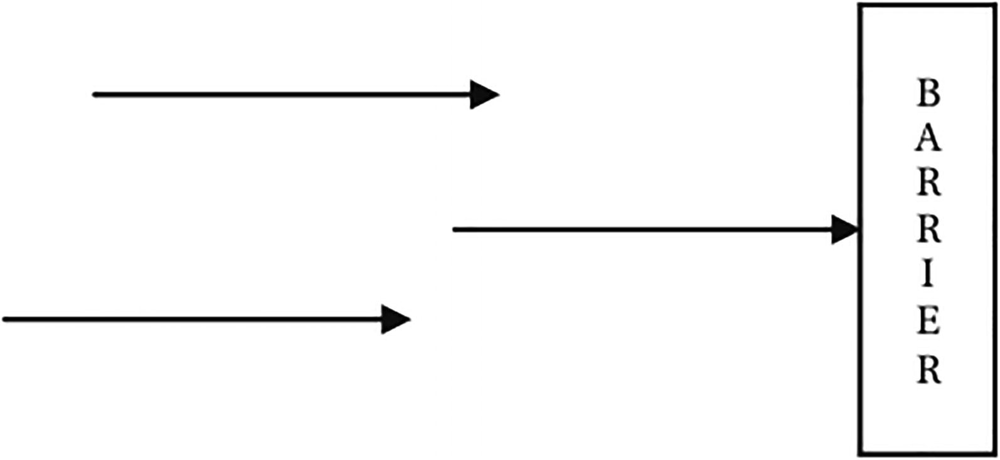
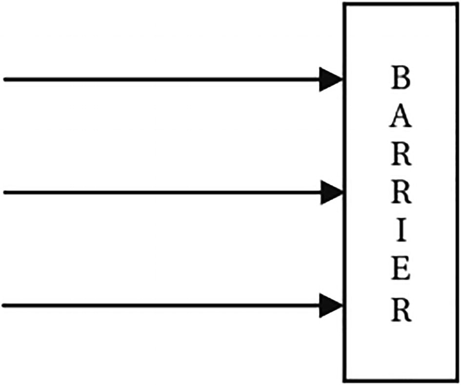
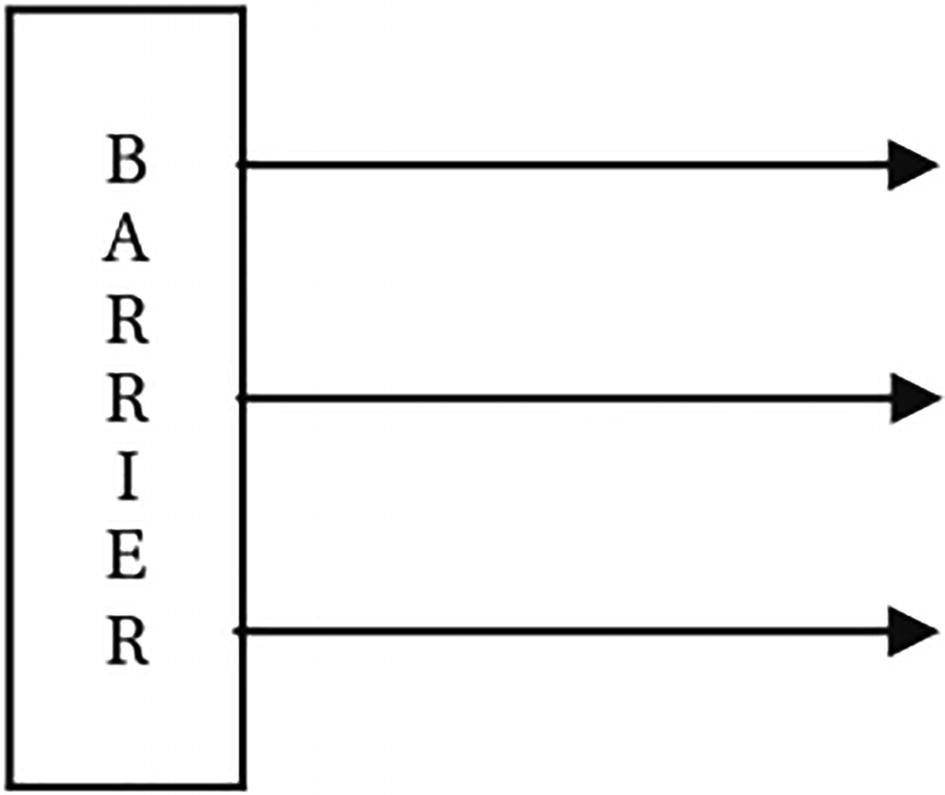

= Barriers

A barrier is used to make a group of threads meet at a barrier point. A thread from a group arriving at the barrier waits
until all threads in that group arrive. Once the last thread from the group arrives at the barrier, all threads in the
group are released. You can use a barrier when you have a task that can be divided into subtasks; each subtask can be
performed in a separate thread, and each thread must meet at a common point to combine their results.

One thread waits for the two other threads to arrive at the barrier

All three threads arrive at the barrier and are then released at once

All three threads pass the barrier successfully

