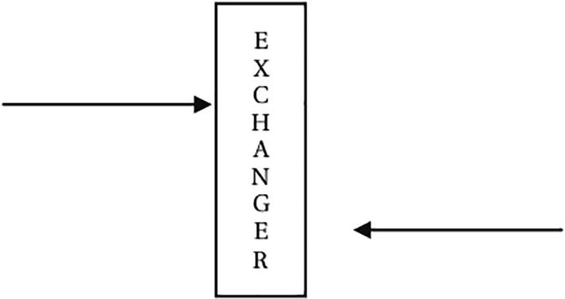
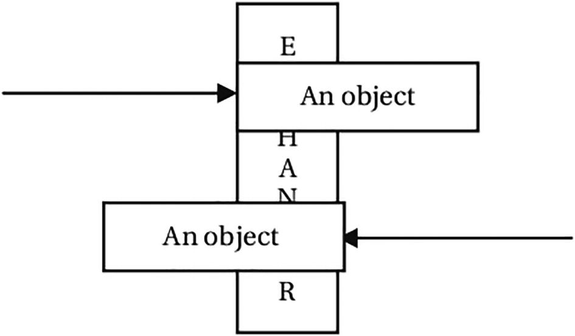

= Exchangers

An exchanger is another form of a barrier. Like a barrier, an exchanger lets two threads wait for each other at a synchronization
point. When both threads arrive, they exchange an object and continue their activities. This is useful in building a system
where two independent parties need to exchange information from time to time.

One thread arrives at the exchange point and waits for another thread to arrive

Two threads meet at the exchange point and exchange objects

