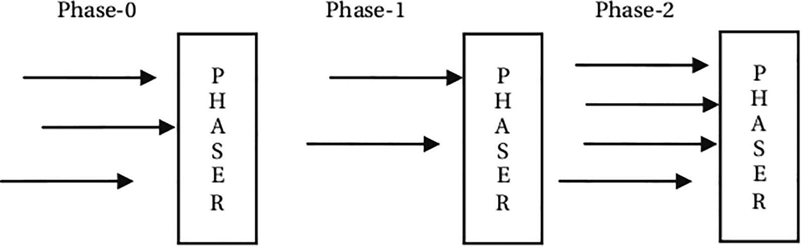

= Phasers

The Phaser class in the java.util.concurrent package provides an implementation for another synchronization barrier called
phaser. A Phaser provides functionality similar to the CyclicBarrier and CountDownLatch synchronizers. However, it is
more powerful and flexible. It provides the following features:

* Like a CyclicBarrier, a Phaser is also reusable.

* Unlike a CyclicBarrier, the number of parties to synchronize on a Phaser can change dynamically. In a CyclicBarrier,
the number of parties is fixed at the time the barrier is created. However, in a Phaser, you can add or remove parties
at any time.

* A Phaser has an associated phase number, which starts at zero. When all registered parties arrive at a Phaser, the
Phaser advances to the next phase, and the phase number is incremented by one. The maximum value of the phase number is
Integer.MAX_VALUE. After its maximum value, the phase number restarts at zero.

* A Phaser has a termination state. All synchronization methods called on a Phaser in a termination state return immediately
without waiting for an advance. The Phaser class provides different ways to terminate a phaser.

* A Phaser has three types of parties count: a registered parties count, an arrived parties count, and an unarrived parties
count. The registered parties count is the number of parties that are registered for synchronization. The arrived parties
count is the number of parties that have arrived at the current phase of the phaser. The unarrived parties count is the
number of parties that have not yet arrived at the current phase of the phaser. When the last party arrives, the phaser
advances to the next phase. Note that all three types of party counts are dynamic.

* Optionally, a Phaser lets you execute a phaser action when all registered parties arrive at the phaser. Recall that a
CyclicBarrier lets you execute a barrier action, which is a Runnable task. Unlike a CyclicBarrier, you specify a phaser
action by writing code in the onAdvance() method of your Phaser class. It means you need to use your own phaser class
by inheriting it from the Phaser class and override the onAdvance() method to provide a Phaser action.

